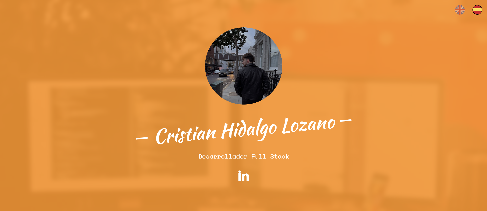

# Cristian Hidalgo Lozano - Portfolio

Este repositorio contiene el código fuente y los archivos necesarios para mi portfolio en línea, donde presento mis proyectos, habilidades y experiencia profesional.

## Acerca de mí

Soy Cristian Hidalgo Lozano, un apasionado desarrollador de software con experiencia en el desarrollo web frontend y backend. Me esfuerzo por crear aplicaciones web elegantes, eficientes y de alto rendimiento utilizando las últimas tecnologías y mejores prácticas de desarrollo.

Puedes obtener más información sobre mi experiencia y formación en mi [LinkedIn](https://www.linkedin.com/in/cristian-hidalgo-lozano-2b50ab23a/).

## Características

- **Portafolio interactivo:** Muestra una selección de mis proyectos destacados con enlaces a sus repositorios y demostraciones en vivo cuando estén disponibles.
- **Sobre mí:** Una breve introducción sobre quién soy y mis áreas de interés.
- **Habilidades técnicas:** Enumeración de las habilidades técnicas y herramientas que utilizo en mi trabajo.
- **Experiencia:** Detalles sobre mi experiencia laboral y educativa.
- **Contacto:** Formulario de contacto para que los visitantes puedan comunicarse conmigo.

## Tecnologías Utilizadas

- HTML5
- CSS3
- JavaScript
- React.js
- Node.js
- Express.js
- MongoDB

## Instalación y Uso

1. Clona este repositorio en tu máquina local usando `git clone`.
2. Instala las dependencias usando `npm install`.
3. Ejecuta la aplicación utilizando `npm start`.
4. Abre tu navegador y navega a `http://localhost:3000` para ver el portfolio en funcionamiento.

## Contribución

¡Las contribuciones son bienvenidas! Si deseas mejorar este portfolio de alguna manera, no dudes en enviar un pull request. Si encuentras algún problema, por favor abre un issue.

## Contacto

Puedes contactarme a través del formulario de contacto en mi [portfolio](https://www.linkedin.com/in/cristian-hidalgo-lozano-2b50ab23a/) o a través de mi [LinkedIn](https://www.linkedin.com/in/cristian-hidalgo-lozano-2b50ab23a/).

¡Gracias por visitar mi portfolio! Espero que encuentres interesante mi trabajo.
